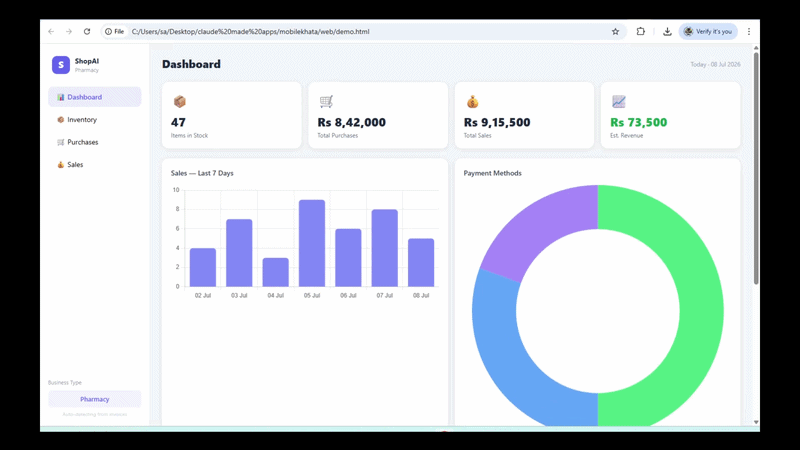

<div align="center">

# 🏪 ShopAI
### Open-Source AI Business Manager — Any Shop, Any Language



[](LICENSE)
[](https://flutter.dev)
[](https://groq.com)
[](https://php.net)
[](https://github.com/chupamobiles-bot/shopAI-Open-source-AI-business-manager)

**Scan any invoice → AI reads it → Inventory updated automatically.**  
Works for any shop. Any language. Completely free.

[✨ Features](#features) · [🚀 Quick Start](#quick-start) · [🧠 How it works](#how-it-works) · [🗺 Roadmap](#roadmap)

</div>

---

## The Problem

Every small shop owner — mobile shop, pharmacy, grocery, clothing — deals with the same nightmare:
- Paper invoices → manual data entry → wasted hours
- POS software costs $30–100/month and doesn't understand YOUR invoices
- Handwritten receipts from local suppliers? No software can read them.

**ShopAI fixes all of this. For free.**

---

## What it does

Point your phone at any invoice or receipt — handwritten, printed, any language — and AI extracts everything automatically. Brand, model, price, supplier, date, quantity. Done in 3 seconds.

| | ShopAI | Typical POS |
|---|---|---|
| Reads handwritten invoices | ✅ AI Vision | ❌ Manual entry only |
| Any language | ✅ Works globally | ❌ English only |
| Any business type | ✅ One config change | ❌ Fixed categories |
| Cost | ✅ **Free** (Groq free tier) | 💸 $30–100/month |
| Self-hosted | ✅ Your own server | ❌ Vendor lock-in |
| Mobile + Web | ✅ Flutter app + Web dashboard | ⚠️ Usually one or the other |

---

## Features

### 📸 AI Invoice Scanning
Powered by Groq Vision — the fastest AI inference available. Sends the image directly, no OCR middleman.

- Handwritten or printed — doesn't matter
- Any language: English, Arabic, Hindi, Chinese, Spanish, French…
- Reads messy layouts, crossed-out prices, unclear handwriting
- Auto-fallback to second model if first is overloaded (zero downtime)

### 🔧 Works for Any Business — One Config Line

```dart
// Open lib/config/preset_configs.dart — change ONE line
final config = BusinessPresets.pharmacy;         // 💊 Pharmacy
// final config = BusinessPresets.groceryStore;  // 🛒 Grocery Store  
// final config = BusinessPresets.clothingStore; // 👗 Clothing Shop
// final config = BusinessPresets.autoParts;     // 🔧 Auto Parts
// final config = BusinessPresets.mobileShop;    // 📱 Mobile Shop
// final config = BusinessPresets.bookstore;     // 📚 Bookstore
// final config = BusinessPresets.restaurant;    // 🍕 Restaurant / Cafe
```

The AI prompts, forms, and inventory columns all update automatically. No other code changes needed.

### 🛠 Or define your own in 10 lines:

```dart
final myConfig = BusinessConfig(
  businessType: 'Jewelry Store',
  currency: 'USD',
  currencySymbol: '\$',
  itemLabel: 'Piece',
  invoiceHint: 'Jewelry invoice with gold/silver items',
  productFields: [
    ProductField(key: 'type',   label: 'Type',   required: true),
    ProductField(key: 'weight', label: 'Weight (grams)'),
    ProductField(key: 'karat',  label: 'Karat',  hint: '18k / 22k / 24k'),
    ProductField(key: 'serial', label: 'Serial No', isIdentifier: true),
  ],
);
```

### 📊 Web Dashboard (no install needed)
Single HTML file — open in any browser. No npm, no Node.js, no build step.

- Live sales charts and inventory stats
- Inventory, purchases, sales tables
- Works on the same API as the mobile app
- Deploy anywhere — Netlify, Vercel, or just open the file

### 📦 Inventory Management
- Auto-updated on every purchase and sale
- Low stock warnings
- Product search

### 💰 Sales & Purchase Tracking
- Cash / Card / Transfer payment tracking
- Customer name + phone auto-filled from scanned receipt
- Purchase invoices auto-fill supplier, date, items, prices

---

## Quick Start

### Prerequisites
- Flutter 3.x
- PHP 8.0+ hosting (Hostinger, Namecheap, any shared host — no Docker needed)
- MySQL 8.0+
- [Groq API key](https://console.groq.com) — **free, no credit card**

### 1. Clone

```bash
git clone https://github.com/chupamobiles-bot/shopAI-Open-source-AI-business-manager.git
cd shopAI-Open-source-AI-business-manager
```

### 2. Configure

```dart
// lib/config/app_config.dart
static const groqApiKey = 'gsk_xxxxxxxxxxxx';      // from console.groq.com (free)
static const apiBaseUrl = 'https://yourhost.com/api';
```

Set your business type in `lib/config/preset_configs.dart` (see above).

### 3. Deploy backend

```bash
# Upload the backend/ folder to your server's public_html
# Then run the DB setup:
mysql -u your_user -p your_db < backend/database.sql
```

Copy `backend/config.example.php` → `backend/config.php` and fill in your DB credentials.

### 4. Run

```bash
flutter pub get
flutter run
```

### 5. Open web dashboard

Open `web/dashboard.html` in any browser → enter your API URL + token → done.

---

## How it works

```
📷 Camera / Gallery
       ↓
 base64 encode image
       ↓
 Groq Vision API  ←── dynamic prompt built from your BusinessConfig
       ↓
 structured JSON  (supplier, items, prices, IMEI/serial, date…)
       ↓
 editable form (you can correct anything)
       ↓
 PHP REST API  →  MySQL  →  inventory updated
       ↓
 Web Dashboard shows live stats
```

The AI prompt is generated from your `BusinessConfig` at runtime — that's how the same code handles a pharmacy, a grocery store, and a mobile shop without any changes.

---

## AI Stack

| Purpose | Primary Model | Fallback |
|---------|--------------|---------|
| Invoice / slip scanning | `meta-llama/llama-4-scout-17b-16e-instruct` | `qwen/qwen3.6-27b` |
| Text extraction | `qwen/qwen3.6-27b` | `llama-3.3-70b-versatile` |
| Provider | [Groq](https://groq.com) — free tier | — |

On 503 (model overloaded), automatically retries then switches model. The user never sees an error.

---

## Project Structure

```
shopai/
├── lib/
│   ├── config/
│   │   ├── business_config.dart        ← ProductField + BusinessConfig classes
│   │   ├── preset_configs.dart         ← 8 ready-made presets
│   │   └── app_config.dart             ← API key, base URL
│   ├── services/
│   │   ├── ai_extraction_service.dart  ← Groq Vision, dynamic prompts, retry logic
│   │   ├── api_service.dart            ← REST client
│   │   └── cloudinary_service.dart     ← invoice image storage (optional)
│   └── screens/
│       ├── dashboard/
│       ├── inventory/
│       ├── purchase/
│       └── sale/
├── web/
│   ├── dashboard.html                  ← self-contained web dashboard
│   └── demo.gif                        ← this README's demo
└── backend/
    ├── index.php                       ← full REST API
    ├── config.example.php              ← copy to config.php
    ├── database.sql                    ← DB schema
    └── migration_generic.sql           ← adds generic JSON fields
```

---

## Roadmap

- [ ] Customer management screen
- [ ] Export to Excel / PDF reports
- [ ] Barcode / QR scanning
- [ ] Multi-user / employee accounts
- [ ] WhatsApp receipt sharing
- [ ] Offline mode with SQLite sync
- [ ] Docker compose setup

---

## Contributing

PRs welcome. Adding a new business type takes ~10 lines:

1. Open `lib/config/preset_configs.dart`
2. Add a `BusinessConfig` with your `ProductField` list
3. Add it to the `all` array at the bottom
4. Submit a PR

See [CONTRIBUTING.md](CONTRIBUTING.md) for full guide.

---

## License

MIT — use it, fork it, sell it, build on it. No strings attached.

---

<div align="center">

Built with Flutter · Groq · PHP · ❤️

**If this saved you time, please ⭐ the repo — it helps others find it.**

</div>
